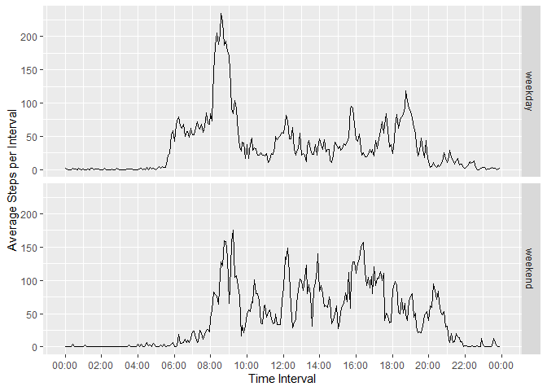

## Loading and preprocessing the data
The first step in this analysis will be to read and process the data. 


```r
library(dplyr)
library(lubridate)
library(ggplot2)
if(!file.exists("activity.csv")) { unzip("activity.zip") }
rawdata <- read.csv("activity.csv", colClasses = c("integer", "Date", "integer"))
fullDateTime <- rawdata$date + hm(rawdata$interval/100)
fullData <- cbind(rawdata, fullDateTime)
```


## What is mean total number of steps taken per day?
Once the data are available we'll determine what the average number of total steps per day is.


```r
fullData <- group_by(fullData, date)
dailySummary <- summarise(fullData, dailySteps = sum(steps))
avgDaySteps <- mean(dailySummary$dailySteps, na.rm = TRUE)
paste("Daily Average Steps: ", round(avgDaySteps, 2))
```

```
## [1] "Daily Average Steps:  10766.19"
```

Also what does the distribution of daily steps look like.


```r
qplot(x = dailySteps, data = dailySummary)
```

<!-- -->

## What is the average daily activity pattern?
Next let's review the average daily activity.


```r
fullData <- ungroup(fullData)  ## Ungrouping by day
fullData <- group_by(fullData, interval)
avgDay <- summarise(fullData, intervalAvg = mean(steps, na.rm = TRUE), 
                    intervalMed = median(steps, na.rm = TRUE))
avgDay$interval <- as_datetime(hm(avgDay$interval/100))
graf <- qplot(x = interval, y = intervalAvg, data = avgDay, geom = "line") +
            xlab("Time Interval") + scale_x_datetime(date_labels = "%R", date_breaks = "2 hours") +
            ylab("Average Steps per Interval")
print(graf)
```

<!-- -->

It can be clearly seen that there is a spike in activity in the morning. Let's determine when 
exactly this happens.


```r
maxStep <- as.data.frame(avgDay[avgDay$intervalAvg == max(avgDay$intervalAvg),])
paste("Peak activity time: ", format(maxStep[1,1], "%R"))
```

```
## [1] "Peak activity time:  08:35"
```

```r
paste("Max average steps: ", round(maxStep[1,2],2))
```

```
## [1] "Max average steps:  206.17"
```

## Imputing missing values
Unfortunately this dataset has many missing values. Let's take a look at how many:


```r
paste("Total number of missing data: ", sum(is.na(rawdata$steps)))
```

```
## [1] "Total number of missing data:  2304"
```

Let's manage this by replacing the missing data with the mean value for that interval. Once this
is completed the histogram for total steps per day becomes:

```r
imputedSteps <- fullData$steps
for (i in 1:length(imputedSteps)) {
    if (is.na(imputedSteps[i])) {
        imputedSteps[i] <- avgDay$intervalAvg[((i-1) %% 288) + 1]
    }
}
imputedData <- cbind(fullData, iSteps = imputedSteps)
imputedData <- ungroup(imputedData)
imputedData <- group_by(imputedData, date)
imputedSummary <- summarise(imputedData, dailySteps = sum(iSteps))
graf2 <- qplot(x = dailySteps, data = imputedSummary)
print(graf2)
```

<!-- -->

Let's briefly see how this changes the mean and median.


```r
library(xtable)
rawMetric <- summary(dailySummary$dailySteps)[3:4]
imputedMetric <- summary(imputedSummary$dailySteps)[3:4]
xt <- xtable(cbind(Raw.Data = rawMetric, Imputed.Data = imputedMetric))
print(xt, type = "html")
```

<!-- html table generated in R 3.6.2 by xtable 1.8-4 package -->
<!-- Sat May 16 09:55:31 2020 -->
<table border=1>
<tr> <th>  </th> <th> Raw.Data </th> <th> Imputed.Data </th>  </tr>
  <tr> <td align="right"> Median </td> <td align="right"> 10765.00 </td> <td align="right"> 10766.19 </td> </tr>
  <tr> <td align="right"> Mean </td> <td align="right"> 10766.19 </td> <td align="right"> 10766.19 </td> </tr>
   </table>

Based on this there appears to be minimal change in the average daily steps by imputing the missing
data.

## Are there differences in activity patterns between weekdays and weekends?
Finally let's review if there are activity trend differences between weekdays and weekends. To do
this we need to identify which data are associated with weekdays and which are on weekends.


```r
dayID <- function(d){ if (wday(d+1)<=2) { "weekend" } else { "weekday" } }
dow <- NULL
for (i in 1:length(fullData$date)) { dow[i] <- dayID(fullData$date[i]) }
fullDataDay <- cbind(fullData, Weekday = dow)
fullDataDay <- group_by(fullDataDay, interval, Weekday)
avgWeekDay <- summarise(fullDataDay, intervalAvg = mean(steps, na.rm = TRUE))
avgWeekDay$interval <- as_datetime(hm(avgWeekDay$interval/100))
```

Once this is done let's compare them visually.


```r
graf3 <- qplot(x = interval, y = intervalAvg, data = avgWeekDay, 
               facets = Weekday ~ ., geom = "line") +
            xlab("Time Interval") + scale_x_datetime(date_labels = "%R", date_breaks = "2 hours") +
            ylab("Average Steps per Interval")
print(graf3)
```

<!-- -->
